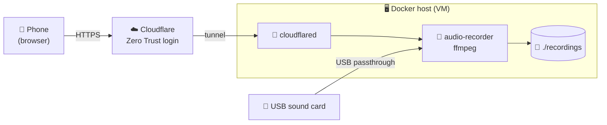

<div align="center">

# 🎸 audio-recorder

**Record your guitar or bass on a home server. Control it from your phone.**

Record · Listen · Share to Messenger / Instagram — over HTTPS, from anywhere.

</div>

---

## ✨ Features

| | |
|---|---|
| 🔴 **Big REC button** | timer, file name and file size while you record |
| 📊 **Live level meter** | peak in dBFS, peak hold and a **CLIP** warning |
| 🎧 **Headphone monitor** | hear yourself through the sound card's headphone jack |
| 📂 **Recordings list** | play with seeking, waveform, download, rename, delete |
| 📍 **Markers** | tap during a take to remember a good moment |
| 📤 **Share** | MP3 or MP4 video to Messenger, Instagram, WhatsApp… |
| 🛟 **Safe files** | FLAC / WAV, repaired after a crash, auto stop at max length or full disk |
| 🌍 **Cloudflare tunnel** | HTTPS from the internet, no open ports |

## 🧭 How it works



The phone is only the remote control. **The sound comes from the USB sound card in the server**,
and the files are saved on the server.

---

## 🚀 Setup

### 1. Give the USB sound card to the VM (Proxmox)

On the **Proxmox host**:

```bash
lsusb                                   # find the card: ID 1234:abcd ...
qm set <VMID> -usb0 host=1234:abcd      # or GUI: VM → Hardware → Add → USB Device
```

In the **VM**, check that it is there:

```bash
apt update && apt install alsa-utils
arecord -l                                          # card 1: SC1 [...], device 0: ...
arecord -D hw:1,0 --dump-hw-params -d 1 /dev/null   # CHANNELS / RATE / FORMAT
```

> **Note:** a 3.5 mm jack on the motherboard can usually **not** be passed to a VM: the onboard
> audio shares its IOMMU group with other chipset devices. Use a USB sound card or a cheap USB adapter.

### 2. Create the Cloudflare tunnel

In the Cloudflare dashboard → **Zero Trust**:

1. **Networks → Tunnels → Create a tunnel** (type *Cloudflared*). Copy the **token** (starts with `eyJ`).
2. **Public hostname**: e.g. `audio.example.com` → service **`http://audio-recorder:8080`**
3. **Access → Applications → Add → Self-hosted** for the same hostname,
   policy *Allow* → your e-mail (login with a one-time PIN). **The app has no login of its own — do not skip this.**
4. *Recommended:* your domain → **Caching → Cache Rules** →
   `Hostname equals audio.example.com` → **Bypass cache**.

### 3. Start

```bash
git clone https://github.com/pvlkrc/audio-recorder.git && cd audio-recorder
cp .env.example .env
nano .env                  # set TUNNEL_TOKEN (and CHANNELS=1 for a mono mic)
docker compose up -d
```

Open **`https://audio.example.com`** on your phone. 🎉
In your LAN it is also at `http://<server-ip>:8080` (without login).

> **No tunnel?** Delete `tunnel` from `COMPOSE_PROFILES` in `.env`. The app then runs only in your LAN.<br>
> **No sound card yet?** Set `AUDIO_DEVICE=test`: everything works with a test tone.

---

## 🎛 Using it

- **Record:** type an optional name (e.g. `bass-riff`) and tap **REC**.
  The file is `2026-10-01_20-40-05_bass-riff.flac`. Recording goes on if you lock the phone.
- **Level:** keep the peak below about −6 dB. **CLIP** = too loud, turn the gain knob down.
- **Headphones:** use the card's **direct monitor** knob (no delay). The 🎧 switch in the app
  sends the sound through the server (~10–20 ms delay). Use it only if the card has no direct monitor,
  and **never both at once** (echo).
- **Share:** 📤 → **🎵 MP3** (Messenger, WhatsApp) or **🎬 MP4** (Instagram: it does not take audio files)
  → **Share** → choose the app. Without HTTPS the file is downloaded instead.

## 🔄 Update

```bash
docker compose pull && docker compose up -d && docker image prune -f
```

A running recording is saved properly before the restart. Recordings and settings stay in `./recordings` and `./data`.

> The image is built by GitHub Actions on every push to `main` (`:latest`) and for tags `v*` (`:1.0.0`).
> If `pull` says *denied*, the package on ghcr.io is private: make it public (GitHub → Packages → Package settings)
> or run `docker login ghcr.io` with a token that has `read:packages`.

---

## ⚙️ Settings (`.env`)

| Variable | Default | |
|---|---|---|
| `TUNNEL_TOKEN` | – | Cloudflare tunnel token |
| `COMPOSE_PROFILES` | `tunnel` | remove `tunnel` to run without Cloudflare |
| `AUDIO_DEVICE` | `auto` | `auto` = first USB card, `test` = test tone, or `hw:CARD=SC1,DEV=0`. The choice in the web page wins. |
| `CHANNELS` | `2` | `1` for a mono mic / adapter |
| `SAMPLE_RATE` | `48000` | some cards / mics: `44100` |
| `BIT_DEPTH` | `16` | `16` or `24` |
| `RECORD_MONO` | `off` | `left` / `right` / `mix` → save a mono file |
| `FORMAT` | `flac` | `flac` or `wav` |
| `MAX_DURATION_MIN` | `120` | recording stops after this time |
| `MIN_FREE_DISK_MB` | `1000` | does not start / stops below this free space |
| `TZ` | `Europe/Prague` | time in file names |
| `HOST_PORT` | `8080` | port in your LAN |
| `PUID` / `PGID` | `1000` | owner of the files on the host |
| `IMAGE_TAG` | `latest` | stay on one version, e.g. `1.0.0` |

<details>
<summary>Advanced settings</summary>

| Variable | Default | |
|---|---|---|
| `USE_DSNOOP` | `true` | share the input (ALSA dsnoop), so recorder, meter and monitor run at once |
| `PLAYBACK_DEVICE` | `auto` | headphone output for the 🎧 monitor (`auto` = same card) |
| `MONITOR_DEFAULT` | `off` | 🎧 monitor on at the first start |
| `MONITOR_LATENCY_US` | `10000` | 🎧 monitor delay; higher = less crackling |

</details>

---

## 🩺 Troubleshooting

| Problem | Fix |
|---|---|
| Input shows only **"Test tone"** | The VM sees no card: check `arecord -l` in the VM, then `docker compose up -d --force-recreate`. |
| `lsusb` shows the card, `arecord -l` does not | `modprobe snd-usb-audio`. The Debian *cloud* kernel has no sound drivers → `apt install linux-image-amd64`. |
| **"Device is busy"** | Another program uses the card: `fuser -v /dev/snd/*`. |
| ⚠ warning about CHANNELS / SAMPLE_RATE | Use the values from `--dump-hw-params` in `.env`. Last resort: `AUDIO_DEVICE=plughw:1,0`. |
| **Permission denied** on `/dev/snd` | Check the group with `ls -ln /dev/snd`; if it is not `29`, put the number in `group_add`. |
| Crackling | Try the USB passthrough with and without *USB3*, give the VM 2+ cores, no passive USB hub. |
| Level meter: "no signal" | Turn up the gain on the card; check the cable and the input switch (instrument / mic). |
| Cloudflare **502** | The tunnel service must be `http://audio-recorder:8080`, and both containers must be in this compose project. |
| Wrong time in file names | Set `TZ` in `.env`. |

## 🛟 Crash safety

A recording is written to a hidden `.<name>.part` file. **Stop** closes it cleanly (`q` → SIGINT → SIGKILL).
`docker stop` stops the recording first. After a power loss, the next start repairs the file
and gives it its normal name.

---

<details>
<summary>🔌 API</summary>

| Method | Path | |
|---|---|---|
| GET | `/api/status` | state, time, file, size, disk space |
| POST | `/api/record/start` | `{"name": "bass-riff"}` (optional) |
| POST | `/api/record/stop` | |
| POST | `/api/record/marker` | `{"note": "..."}` (optional) |
| GET | `/api/recordings` | list, newest first |
| GET | `/api/recordings/{file}` | stream (HTTP Range) |
| GET | `/api/recordings/{file}/download` | download |
| PATCH | `/api/recordings/{file}` | rename: `{"name": "new-tag"}` (the date stays) |
| DELETE | `/api/recordings/{file}` | delete |
| POST | `/api/recordings/{file}/mp3` | make an MP3 copy |
| GET | `/api/recordings/{file}/share/mp3` · `/share/mp4` | file for sharing |
| GET | `/api/recordings/{file}/markers` | markers |
| GET · PUT | `/api/devices` · `/api/devices/selected` | list / choose the input |
| GET · PUT | `/api/monitor` | `{"enabled": true}` |
| WS | `/ws/level` | `{"peak_db": [-12.3, -14.0], "clip": false, "active": true}` |

</details>

<details>
<summary>🧪 Development</summary>

```bash
# Tests in Docker (with ffmpeg, no sound card needed)
docker build --target test -t audio-recorder:test . && docker run --rm audio-recorder:test

# Build and run from source, with the test tone
AUDIO_DEVICE=test docker compose -f docker-compose.yml -f docker-compose.build.yml up -d --build
```

Stack: Python 3.12 · FastAPI · ffmpeg / ALSA · plain HTML + JS (no build step).

</details>
